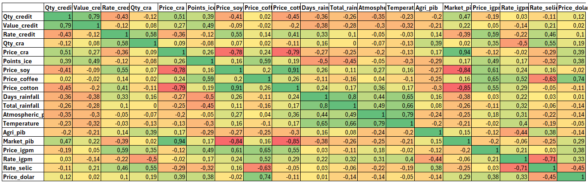

# 🎓 Impact of Macroeconomic Variables and Agricultural Production Factors on the Demand for Rural Credit

[](https://www.python.org/)
[]()

## 📝 Context

### Description

Developed as a Final Course Project (Business Management Technology), this project seeks to understand the sensitivity of rural credit demand to macroeconomic variables and productive factors. Additionally, it explores how it is possible to prepare for different economic scenarios using statistical models. 

### Problem

Agriculture, the main sector of the Brazilian economy, is very sensitive to rural credit, therefore, knowing which indicators have the greatest impact on demand is important to prepare for adverse situations and take advantage of market opportunities. 

### Goal

Identify and quantify the relationships between macroeconomic variables and agricultural production indicators with the demand for rural credit, and use statistical models to find the best scenarios.

### Fundamental Concepts

**Macroeconomic**: They are indicators or tools for controlling economic and monetary policy, such as GDP (Gross Domestic Product), interest rates, exchange rates, and inflation.

**Agriculture**: They are variables that affect agricultural production, such as temperature and rainfall, for example, as they are natural physical factors that have an influence.

**Rural Credit**: Financing modality aimed at rural producers, based on production and price expectations, such as commodity prices and harvest volume. 

## 🎲 Data Used 

### Data Sources

- [**Banco Central do Brasil (BCB)**](https://dadosabertos.bcb.gov.br/): Selic rate (Brazil's base interest rate), Exchange rate and Credit Contracts - API
- [**Fundação Getulio Vargas (FGV)**](https://autenticacao-ibre.fgv.br/ProdutosDigitais/Login): IGPM (price inflation index), ICE (business confidence index) and PIB (GDP) - CSV
- [**Centro de Estudos Avançados em Economia Aplicada (CEPEA)**](https://www.cepea.org.br/br/consultas-ao-banco-de-dados-do-site.aspx): Commodity prices - CSV
- [**Instituto Nacional de Meteorologia (INMET)**](https://bdmep.inmet.gov.br/): Rainfall, Atmospheric pressure e Temperature - CSV
- [**Comissão de Valores Mobiliários (CVM)**](https://dados.cvm.gov.br/): CRA (Agribusiness Receivables Certificate) - CSV

**Period analyzed**: January 2022 to December 2024

### Tools and Libraries
- [**Databricks**](https://login.databricks.com/signup?provider=DB&l=pt-BR&scid=7018Y000001Fi0cQAC&utm_medium=paid+search&utm_source=google&utm_campaign=19829725165&utm_adgroup=147439757256&utm_content=trial&utm_offer=trial&utm_ad=731917902921&utm_term=databricks&gad_source=1&gad_campaignid=19829725165&gbraid=0AAAAABYBeAhHda15kPPFIDjUtw9-JMztZ&gclid=CjwKCAiAjojLBhAlEiwAcjhrDlPAAhrvFx0npdc3nhzsuLzZN0CJWRF5uHdoSWv184ta5Lkxm7qHHxoCMlMQAvD_BwE&tuuid=fbfd3b91-9b8a-430c-b85a-198942daaf68&intent=SIGN_UP&dbx_source=direct&rl_aid=8df46689-73f9-42c6-b642-698357080083&sisu_state=eyJsZWdhbFRleHRTZWVuIjp7Ii9zaWdudXAiOnsidG9zIjp0cnVlLCJwcml2YWN5Ijp0cnVlLCJjb3Jwb3JhdGVFbWFpbFNoYXJpbmciOnRydWV9fX0%3D) - Python 3.11 and SQL 
- [**pyspark**](https://spark.apache.org/docs/latest/api/python/index.html) - SQL functions
- [**requests**](https://pypi.org/) - API acess
- [**pandas**](https://pandas.pydata.org/) - Data processing
- [**numpy**](https://numpy.org/) - Numerical operations
- [**matplotlib**](https://matplotlib.org/) - Visualization
- [**scikit-learn**](https://scikit-learn.org/stable/) - Linear Regression and statistical modeling
- [**statsmodels**](https://www.statsmodels.org/stable/index.html) - Time series and correlation matrix 

## 📁 Repository Structure

```
📦 TCC-RuralCredit 
├── 📂 datas                                      # Processed data
│   ├── tb_clima_inmet.csv              
│   ├── tb_commodities_cepea.csv              
│   ├── tb_cra_cvm.csv
│   ├── tb_credit_agreements.csv              
│   ├── tb_ice_fgv.csv              
│   ├── tb_igpm_fgv.csv              
│   └── tb_pib_fgv.csv                                       
├── 📂 scripts                                    # Python scripts 
│   ├── Collection and Creation of Tables.py
│   ├── Datas Cleansing and Processing.py
│   ├── Linear Regression.py
│   └── Time Series.py
├── 📂 visualizations                             # Graphs and figures
│   ├── ACF - Autocorrelation Function.png
│   ├── Credit Demand Forecast - SARIMA.png
│   ├── Frist Test - Multiple Linear Regression.png
│   ├── PACF - Partial Autocorrelation Function.png
│   ├── Scatter Plot Clean:(...).png         # more 31 plots
│   ├── Second Test - Multiple Linear Regression.png
│   └── Simple Time Series.png  
└── README.md                                     # This file
```

## 📊 Methodology

### 1° - Collection and Processing

A primeira etapa foi a coleta de dados confiaveis, originais e atualizados das fontes citadas anteriormente, e no tratamento convertendo e renomeando as colunas. Os dados serão divididos em variáveis dependentes, relacionados a crédito rural, e pelas variáveis independentes, relacionadas a indicadores macroeconômicas e fatores produtivos. 

**`Exemplo em código:`**
```python 
datas_qtycredit = spark.table('workspace.default.tb_credit_agreements')
df_qtycredit = datas_qtycredit
df_qtycredit = (
    df_qtycredit
    .withColumnRenamed('Data', 'Date_event')        
    .withColumnRenamed('QtdInvestimento', 'Qty_credit')
    .withColumnRenamed('VlInvestimento', 'Value_credit')
    .withColumn('Date_event', to_date(col('Date_event'), 'dd/MM/yyyy'))
)

api_rtcredit = f'https://api.bcb.gov.br/dados/serie/bcdata.sgs.20758/dados?formato=json&dataInicial={start_date}&dataFinal={final_date}'
response_rtcredit = requests.get(api_rtcredit)
datas_rtcredit = response_rtcredit.json()
df_rtcredit = spark.createDataFrame(datas_rtcredit)
df_rtcredit = (
    df_rtcredit
    .withColumnRenamed('data', 'Date_event')
    .withColumnRenamed('valor', 'Rate_credit')
    .withColumn('Date_event', to_date(col('Date_event'), 'dd/MM/yyyy'))
    .withColumn('Rate_credit', col('Rate_credit').cast('double'))
)

df_credit_demand = (df_qtycredit.join(df_rtcredit, on='Date_event', how='left'))
df_credit_demand = (
    df_credit_demand
    .withColumn('Qty_credit', col('Qty_credit').cast('double'))
    .withColumn('Value_credit', col('Value_credit').cast('double'))
    .withColumn('Rate_credit', col('Rate_credit').cast('double'))
    .orderBy('Date_event')
)
df_credit_demand.write.mode('overwrite').saveAsTable('workspace.default.tb_credit_demand')
display(df_credit_demand)
```

### 2° - Z-Score Standardized

O Z-score é uma técnica estatística de padronização, colocando as variáveis em uma escala comum ao transformar os dados para média de 0 e um desvio-padrão de 1. Ele tira o foco do valor absoluto e o coloca no contexto, indicando quantos desvios-padrão um ponto de dado está distante da média de um conjunto de dados, permitindo comparações.

**`Exemplo em código:`**
```python 
numeric_columns = [
    field.name
    for field in df_main.schema.fields
    if isinstance(field.dataType, NumericType)
]

for columns in numeric_columns:
    stats = df_main.select(
        functions.mean(columns).alias('average'),
        functions.stddev(columns).alias('deviation')
    ).collect()[0]

    df_standardized = df_standardized.withColumn(f'{columns}_standardized',
        functions.round((functions.col(columns) - stats['average']) / stats['deviation'], 2))

for columns in numeric_columns:
    df_standardized = df_standardized.drop(columns).withColumnRenamed(f'{columns}_standardized', columns)

display(df_standardized)
```

### 3° - Interquartile Range

O intervalo interquartil é uma medida que indica o valor abaixo do qual parte das observações se encontram, e serve para encontrar outilers. Esse valor é calculado para dois grupos observados, correspondendo 25% e 75% da amostra. Ele representa a dispersão entre os dados, e para estimar os possíveis limites de dispersão normais é calculado o limite inferior e superior.

**`Exemplo em código:`**
```python 
results = []
for columns in numeric_columns:
    Q1, Q3 = df_standardized.approxQuantile(columns, [0.25, 0.75], 0.01)
    IQR = Q3 - Q1
    lower_limit = Q1 - (1.5 * IQR)
    upper_limit = Q3 + (1.5 * IQR)
    results.append({
        'columns': columns,
        'Q1': round(Q1, 2),
        'Q3': round(Q3, 2),
        'IQR': round(IQR, 2),
        'Lower_limit': round(lower_limit, 2),
        'Upper_limit': round(upper_limit, 2)
    })

df_outliers = pd.DataFrame(results)
display(df_outliers)
df_pd = df_standardized.select(['Date_event'] + numeric_columns).toPandas()
```

No primeiro gráfico, as duas últimas observações estão acima do limite superior, são outilers. No segundo gráfico, os outilers foram substituidos pela média das observações e reajustado para ser usado em modelos. 

<p align="center">
  
  
</p>

### 4° - Correlation Matrix 

A Matriz de Correlação também é uma ferramenta da estatistica usada para encontrar as variáveis mais correlacionadas com a variável dependente. Ela exibe os coeficientes de correlação entre diferentes pares de dados, representando a força de uma variável em relação a outra, onde quanto mais próximo de 1, correlação positiva, e quanto mais próximo do -1, correlação negativa.

**`Exemplo em código:`**
```python 
df_standardized = spark.table('workspace.default.tb_standardized_data')

numeric_columns = [
    field.name
    for field in df_standardized.schema.fields
    if isinstance(field.dataType, NumericType)
]

correlation = df_standardized.select(numeric_columns).toPandas().corr()
correlation.insert(0, '', correlation.index)
display(correlation.round(2))
``` 

Abaixo está a Matriz de Correlação expressa com Escala de Cores, para melhor visualização. As três primeiras colunas são as variáveis de estudo, quantidade, valores e taxas médias, respectivamente. A primeira coluna representa a demanda, e como é perceptível, o valor de crédito, preço de CRA, PIB e ICE possuem correlação positiva.

<p align="center">


### 5° - Linear Regression


### 6° - Time Series

    
---

⭐ **If this project was helpful to you, consider giving the repository a star!**